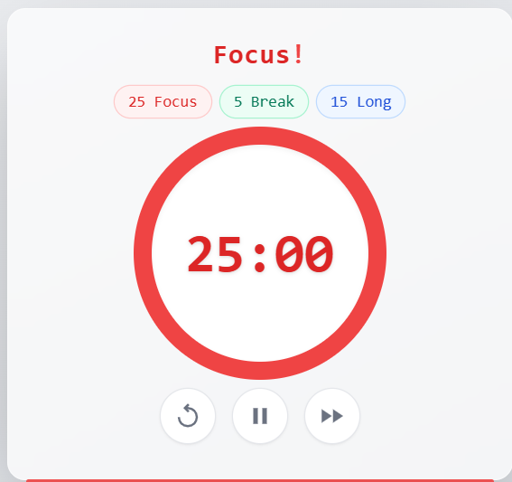

# Pomodoro Timer

Bu proje, odaklanma ve mola sürelerini yönetmek için geliştirilmiş basit bir **Pomodoro Zamanlayıcı** uygulamasıdır.  
HTML, Tailwind CSS ve JavaScript kullanılarak geliştirilmiştir.

 

## 🚀 Özellikler
- **25 dakika odaklanma süresi**
- **5 dakika kısa mola**
- **15 dakika uzun mola**
- Zamanı başlatma, duraklatma ve sıfırlama butonları
- Modern ve minimal tasarım
- Responsive (mobil uyumlu) arayüz

   
